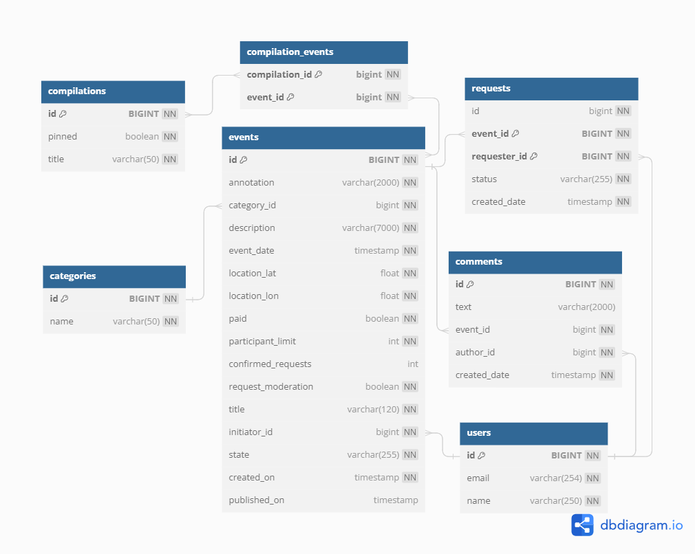
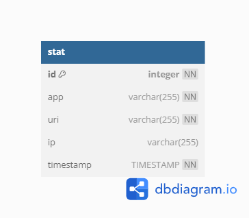

# java-explore-with-me
<!-- Template repository for ExploreWithMe project.
https://github.com/Zhanna85/java-explore-with-me/pull/5
-->
**Свободное время — ценный ресурс. Ежедневно мы планируем, как его потратить — куда и с кем сходить. Сложнее всего в таком планировании поиск информации и переговоры. Нужно учесть много деталей: какие намечаются мероприятия, свободны ли в этот момент друзья, как всех пригласить и где собраться.**

**Афиша событий - приложение разработанное для решения этих задач. В этой афише можно предложить какое-либо событие от выставки до похода в кино и собрать компанию для участия в нём.**

## Стек используемых технологий:
Java 11, REST-сервис с использованием Spring Boot, Spring Data JPA, Hibernate, Lombok, Maven, JUnit, Postgresql, Doker.

## Описание функционала 
Приложение состоит из двух сервисов:
- Основной сервис - содержит всё необходимое для работы продукта;
- Сервис статистики - хранит количество просмотров и позволяет делать различные выборки для анализа работы приложения.

### API основного сервиса разделена на три части:

#### - Публичная - доступна без регистрации любому пользователю сети.
Публичный API предоставляет возможности поиска и фильтрации событий: 
* Сортировка списка событий организована либо по количеству просмотров, которое запрашиваться в сервисе статистики, либо по датам событий.
* При просмотре списка событий возвращаться только краткая информация о мероприятиях.
* Просмотр подробной информации о конкретном событии настроен отдельно (через отдельный эндпоинт);
* Каждое событие относиться к какой-то из закреплённых в приложении категорий.
* Настроена возможность получения всех имеющихся категорий и подборок событий (такие подборки составляют администраторы ресурса);
* Каждый публичный запрос для получения списка событий или полной информации о мероприятии фиксируется сервисом статистики.

#### - Закрытая - доступна только авторизованным пользователям.
В закрытой части API реализованы возможности зарегистрированных пользователей продукта. Авторизованные пользователи имеют возможность:
* добавлять в приложение новые мероприятия, редактировать их и просматривать после добавления;
* подавать заявки на участие в интересующих мероприятиях;
* добавлять комментарии, просматривать (свои комментарии и все комментарии по событию), редактировать и удалять добавленные комментарии;
* создатель мероприятия имеет возможность подтверждать заявки, которые отправили другие пользователи сервиса.

#### - Административная — для администраторов сервиса.
Административная часть API предоставляет возможности настройки и поддержки работы сервиса. Администраторы сервиса имеют возможность:
* добавлять, изменять и удалять категории для событий;
* добавлять, удалять и закреплять на главной странице подборки мероприятий;
* модерация событий, размещённых пользователями, — публикация или отклонение;
* управление комментариями - удаление, редактирование, просмотр;
* управление пользователями — добавление, активация, просмотр и удаление.

### Модель данных
Жизненный цикл события включает несколько этапов:
* Создание.
* Ожидание публикации. В статус ожидания публикации событие переходит сразу после создания.
* Публикация. В это состояние событие переводит администратор.
* Отмена публикации. В это состояние событие переходит в двух случаях. Первый — если администратор решил, что его нельзя публиковать. Второй — когда инициатор события решил отменить его на этапе ожидания публикации.

### Сервис статистики
Он собирает информацию. Во-первых, о количестве обращений пользователей к спискам событий и, во-вторых, о количестве запросов к подробной информации о событии. На основе этой информации формируется статистика о работе приложения.2

#### Функционал сервиса статистики содержит:
* запись информации о том, что был обработан запрос к эндпоинту API;
* предоставление статистики за выбранные даты по выбранному эндпоинту.
  
Чтобы можно было использовать сервис статистики, реализован HTTP-клиент (WebClient). Он отправляет запросы и обрабатывает ответы.

## Описание баз данных

### База данных основного сервиса (ewm-service)
На диаграмме ниже представлен визуальный обзор базы данных основного сервиса и связей между таблицами.

Ниже приведен обзор таблиц базы данных:

**users**: содержит данные о пользователях.  
**requests**: содержит данные заявок пользователей на участие в событиях.  
**events**: содержит данные о событиях/мероприятиях.  
**comments**: содержит данные о комментариях к событиям/мероприятиям.  
**categories**: содержит данные о категориях для событий/мероприятий.  
**compilations**: данные о подборках событий/мероприятий.  
**compilation_events**: данная таблица связывает идентификаторы подборки из таблицы **compilations** и событий/мероприятий из таблицы **events**, которые входят в данную подборку.

### База данных сервиса статистики (stats-service)
На диаграмме ниже представлен визуальный обзор базы данных сервиса статистики. 

На данный момент сервис статистики состоит из одной таблицы **stat**, которая содержит данные о количестве обращений пользователей к спискам событий.

## Инструкция по развёртыванию
Для удобного развертывания приложения реализован docker-compose.yml, содержащий все необходимые параметры. Убедитесь, что порты указанные в docker-compose.yml свободны на устройстве.
